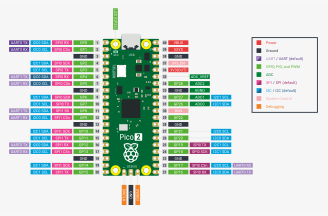

# Lab 5: Smart Home Status Monitor

Welcome to Lab 5! In this lab, you will create a smart home monitoring system that demonstrates adding and removing IoT devices from lists using LED status indicators and button control.

## Learning Objectives

Master **Python list modification** through IoT device management:
- **List modification methods** - use `append()` and `remove()` methods for device control
- **IoT concepts** - simulate smart home device management with meaningful hardware
- **Interactive programming** - combine user input with button confirmation for device commands
- **Status monitoring** - use LEDs to provide real-time visual feedback of system states

*This assignment aligns with CMPSC 100 Learning Outcomes 1 and 2, focusing on Python programming fundamentals applied to IoT concepts. It builds on Lab 4's list concepts while introducing practical device management and status monitoring. This lab also fulfills Allegheny College's Quantitative Reasoning (QR) distribution requirement through data manipulation, conditional logic, and computational problem-solving applied to smart home systems.*

## Prerequisites

Before starting this lab, ensure you have:
- VS Code with MicroPico extension installed (from Lab 2)
- Your Pico 2 W board and USB cable ready
- Understanding of basic list concepts from Lab 4 (creation, indexing, iteration)
- Experience with GPIO pin control from Labs 2-4
- Understanding of loops and conditionals from Weeks 3-5

### Hardware Components:
- **3 LEDs**
- **1 button** (push button)
- **3 × 220Ω or 330Ω resistors** for LEDs
- **1 breadboard**
- **5-6 jumper wires** (male-to-male, any colors)

## IoT Concepts

### Smart Home Systems
**IoT devices** are interconnected devices that can be monitored and controlled remotely:
- **Device status tracking**: Maintain lists of active vs. available devices
- **System indicators**: Visual feedback showing which home systems are operational
- **Remote control**: Button-based commands to turn devices on/off
- **Real-time monitoring**: Immediate status updates when devices change state

### LED Status Indicators
Using LEDs for **system status visualization** (customize these examples to your chosen systems):
- **System LED 1** (e.g., Security/Red): Indicates when related devices are active (cameras, locks, alarms)
- **System LED 2** (e.g., HVAC/Yellow): Shows system status (thermostat, fans, heaters)
- **System LED 3** (e.g., Lighting/Green): Displays related device status (smart lights, lamps)
- **Dynamic updates**: LEDs automatically reflect current device states based on your categorization

## Circuit Assembly

### Pinout Reference


### Example Wiring Setup (adapt to your chosen pins and systems):
- **Pico placement**: Columns C-H, rows 1-20
- **System LED 1** (e.g., Security/Red): Column E, row 21 → Resistor (column A/B, row 20) → GPIO 15 (Pin 20) *[or any GPIO pin]*
- **System LED 2** (e.g., HVAC/Yellow): Column E, row 22 → Resistor (column A/B, row 19) → GPIO 14 (Pin 19) *[or any GPIO pin]*
- **System LED 3** (e.g., Lighting/Green): Column E, row 23 → Resistor (column A/B, row 17) → GPIO 13 (Pin 17) *[or any GPIO pin]*
- **LED grounds**: Column J, rows 21/22/23 → Blue ground rail (-) *[or other placement of your choosing]*
- **Control Button**: Rows 27 & 29, columns E-H → GPIO 12 (Pin 16) *[or any GPIO pin]*

### Detailed Assembly Steps:

#### Step 1: Safety and Setup
- **Connect USB cable** from laptop to Pico 2 W
- **Pico placement**: Columns C-H, rows 1-20 (USB connector toward you) *[or other placement of your choosing]*
- **Power/Ground**: Row 3, column J to blue ground rail (-) *[or other GND placement of your choosing]*

#### Step 2: Place Resistors
- **Resistor 1**: Column A or B, row 20 (for System LED 1, e.g., Security) *[or other placement of your choosing]*
- **Resistor 2**: Column A or B, row 19 (for System LED 2, e.g., HVAC) *[or other placement of your choosing]*
- **Resistor 3**: Column A or B, row 17 (for System LED 3, e.g., Lighting) *[or other placement of your choosing]*

#### Step 3: Place LEDs 
- **System LED 1** (e.g., Security/Red): Column E, row 21 *[or other placement of your choosing]*
- **System LED 2** (e.g., HVAC/Yellow): Column E, row 22 *[or other placement of your choosing]*
- **System LED 3** (e.g., Lighting/Green): Column E, row 23 *[or other placement of your choosing]*

#### Step 4: Wire GPIO to Resistors (example pins - use your chosen GPIO pins)
- **GPIO 15** (Pin 20): Connect to resistor in row 20 → LED row 21 *[or your chosen pin]*
- **GPIO 14** (Pin 19): Connect to resistor in row 19 → LED row 22 *[or your chosen pin]*
- **GPIO 13** (Pin 17): Connect to resistor in row 17 → LED row 23 *[or your chosen pin]*

#### Step 5: Wire Resistors to LEDs
- **Row 20 resistor**: Connect to System LED 1 in column E, row 21 *[or other placement corresponding to your LED placement]*
- **Row 19 resistor**: Connect to System LED 2 in column E, row 22 *[or other placement corresponding to your LED placement]*
- **Row 17 resistor**: Connect to System LED 3 in column E, row 23 *[or other placement corresponding to your LED placement]*

#### Step 6: Connect LED Grounds
- **All system LED grounds**: Column J, rows 21/22/23 to blue ground rail (-) *[or other placement corresponding to your LED placement]*

#### Step 7: Add Button (4-Leg Tactile Switch)
- **Button orientation**: Spans center gap, columns E-H *[or other placement of your choosing]*
  - **Top-left leg**: Row 27, column E
  - **Top-right leg**: Row 27, column H
  - **Bottom-left leg**: Row 29, column E
  - **Bottom-right leg**: Row 29, column H
- **GPIO 12 jumper wire**: Connect GPIO 12 (Pin 16) to row 27, column D *[or your chosen button pin]*
- **Button ground jumper wire**: Connect row 29, column J to blue ground rail (-) *[or other placement corresponding to your button position]*

#### Step 9: Final Check
- **Visual inspection**: All connections secure, correct LED polarity
- **Power verification**: 3V3 and GND connected to power rails
- **Component placement**: Resistors and LEDs in correct rows 

## Programming with IoT Device Management

Open `src/main.py` and work through the concepts to create your smart home monitor:

### Core Programming Tasks:
1. **Device Lists** - Create lists to track active and available IoT devices
2. **Device Control** - Use `append()` and `remove()` to turn devices on/off
3. **Status Monitoring** - Update LED indicators based on device types in active list
4. **Button Control** - Require button confirmation for device commands
5. **System Integration** - Connect device status to appropriate LED indicators

### Understanding List-Based Device Management

#### Adding Devices (Turn ON)
**append() method** - Adds device to active list:
```python
active_devices = ["thermostat"]
active_devices.append("living_room_lights")  # Turn on lights
# active_devices becomes ["thermostat", "living_room_lights"]
```

#### Removing Devices (Turn OFF)
**remove() method** - Removes device from active list:
```python
active_devices = ["thermostat", "security_camera", "front_door_lock"]
active_devices.remove("thermostat")  # Turn off thermostat
# active_devices becomes ["security_camera", "front_door_lock"]
```

#### LED Status Logic
**Smart indicators** based on device types (customize for your chosen systems):
```python
# Example: System LED 1 (Security) - ON if security devices are active
system1_active = False
for device in active_devices:
    if "lock" in device or "camera" in device or "security" in device:
        system1_active = True
        break

if system1_active:
    led_system1.on()  # Use your chosen LED variable name
else:
    led_system1.off()
```

### Button Integration for IoT Commands

Your program uses **button confirmation** for device commands:
```python
print("Press button to execute command...")
while button.value() == 1:  # Wait for button press
    time.sleep(0.1)
time.sleep(0.3)  # Debounce delay
while button.value() == 0:  # Wait for button release
    time.sleep(0.1)
```

## Required Features for Complete Implementation

Your program must demonstrate **IoT device management**:

#### Essential Lists (2 required):
1. **`active_devices`** - Devices currently turned ON
2. **`available_devices`** - All devices that can be controlled

#### List Methods:
- **`append()`** - Turn devices ON (add to active list)
- **`remove()`** - Turn devices OFF (remove from active list)
- **List membership** - Check if devices are active using `in` operator

#### IoT Features:
- **Device categorization** by type (security, HVAC, lighting)
- **LED status indicators** that reflect current system states
- **Button confirmation** for all device commands
- **Real-time updates** when devices change state

## Testing Your Code

1. **Test circuit**: Run `src/test_LED.py` to verify LEDs and button work
2. **Test device control**: Verify devices can be added/removed from active list
3. **Test LED indicators**: Confirm LEDs update based on device types
4. **Test button control**: Verify button confirmation works for commands

## Troubleshooting

### Circuit Issues:
- **LEDs not lighting**: Check polarity (long leg to positive), resistor connections
- **Button not responding**: Verify ground connection and pull-up setting
- **Wrong LED indicators**: Check GPIO pin assignments match code

### Code Issues:
- **List errors**: Verify method syntax - `list.append(item)`, `list.remove(item)`
- **Device not found**: Check spelling of device names when removing
- **LED logic**: Ensure device type checking works with string contains (`in`)

## Assessment Criteria - Total: 3.5 Points

### Technical Implementation (2.0 points)
- **Automated GatorGrade checks**: 1.5 points (based on list methods and IoT concepts)
- **Hardware execution verification**: 0.5 points (program runs correctly with LED/button circuit)

### Code Quality and Style (1.0 point)  
- **Clear variable names** and **organized structure** (0.6 pts)
- **Appropriate comments** explaining IoT device logic (0.4 pts)

### Reflection and Engagement (0.5 points)
- **Thoughtful reflection** on IoT concepts and list modification

*GatorGrade checks verify: list method usage, device management, LED control, and IoT concepts*

## Hardware Concepts

### Electronic Components
**LEDs and resistors** work together to create safe, controlled lighting:
- **LEDs**: Light-emitting diodes that show system status
- **Resistors**: Limit current to protect LEDs from damage
- **Button**: Provides tactile input for device commands
- **GPIO pins**: Control hardware through digital signals

## Programming with IoT Device Management

Open `src/main.py` and examine the IoT smart home monitoring system:

## Testing Your Code

1. **Test circuit**: Run `src/test_LED.py` to verify all LEDs work
2. **Run main program**: Execute your list-powered light show
3. **Verify patterns**: Check that list iteration creates correct LED sequences
4. **Test user interaction**: Confirm input handling and show customization

## Troubleshooting

### Circuit Issues:
- **LEDs not lighting**: Check polarity, resistors, and GPIO pin numbers
- **Partial lighting**: Verify power rail connections (3V3 and GND)
- **Inconsistent behavior**: Ensure secure breadboard connections

### Code Issues:
- **List errors**: Check list syntax `[item1, item2, item3]` and indexing `list[0]`
- **Loop problems**: Verify indentation and range values
- **User input**: Test input validation and variable assignments

## Submission Instructions

Submit to GitHub frequently! Use this workflow:

```bash
git add src/main.py writing/reflection.md
git commit -m "Complete LED light show with lists programming"
git push
```

Verify your submission online and ensure GatorGrade passes automated testing.

## Getting Help

### During Lab
- Ask TLs or instructor for help with specific questions or hardware issues
- Work with classmates on understanding concepts (but write your own code)
- Use the lab time to understand list concepts and get started with your program

### Outside Lab  
- Post questions in Discord
- Attend [TL office hours](https://www.cis.allegheny.edu/teaching/technicalleaders/) and/or [instructor office hours](https://janyljumadinova.com/schedule/) to seek help outside of class
- Review the slides for concept reinforcement

### Resources
- [Python Documentation](https://docs.python.org/3/)
- [MicroPython Documentation](https://docs.micropython.org/)
- Course slides and examples from class activities

## Assessment Criteria - Total: 3.5 Points

### Technical Implementation (2.0 points)
- **Automated GatorGrade checks**: 1.5 points (based on IoT device management and list methods)
- **Hardware execution verification**: 0.5 points (program runs correctly with LED/button circuit)

### Code Quality and Style (1.0 point)  
- **Clear variable names** and **organized structure** (0.6 pts)
- **Appropriate comments** explaining IoT device logic (0.4 pts)

### Reflection and Engagement (0.5 points)
- **Thoughtful reflection** on IoT concepts and list modification

*GatorGrade checks verify: list method usage, device management, LED control, and IoT concepts*

## Sample Output

Example output from your smart home monitor (LEDs show system status):

```
Smart Home Control System
Select option 3 to exit the program

==================================================
SMART HOME SESSION
==================================================

Homeowner name: JJ
*** Smart Home Status Monitor ***
======================================
Welcome to your IoT device manager!
======================================

Welcome home, JJ!

Testing home systems...
Security system...
HVAC system...
Lighting system...
All systems operational!

Initializing smart home devices...
Adding devices to available control list...
Device setup complete!

JJ's Smart Home Status:
Active devices:
  1. thermostat

Available devices (3 total):
  1. thermostat
  2. front_door_lock
  3. living_room_lights

======================================
Home Control Operation 1

Choose an action:
1. Turn ON a device (add to active list)
2. Turn OFF a device (remove from active list)
3. Exit program
Enter choice (1, 2, or 3): 1

Available devices to turn ON:
  1. front_door_lock
  2. living_room_lights
Choose device (1-2): 1
Press button to confirm...
Button pressed - command confirmed!
Turned ON: front_door_lock

Updated Status (2 devices active):
  thermostat
  front_door_lock

======================================
Home Control Operation 2

Choose an action:
1. Turn ON a device (add to active list)
2. Turn OFF a device (remove from active list)
3. Exit program
Enter choice (1, 2, or 3): 2

Active devices to turn OFF:
  1. thermostat
  2. front_door_lock
Choose device (1-2): 2
Press button to confirm...
Button pressed - command confirmed!
Turned OFF: front_door_lock

Updated Status (1 devices active):
  thermostat

======================================
Home Control Operation 3

Choose an action:
1. Turn ON a device (add to active list)
2. Turn OFF a device (remove from active list)
3. Exit program
Enter choice (1, 2, or 3): 3

Exiting Smart Home Control System...
All systems powered down. Goodbye!
```

*Your LEDs will dynamically show which home systems are active based on device types in your lists. Example: System 1 (red), System 2 (yellow), and System 3 (green) - customize to match your chosen home systems.*
